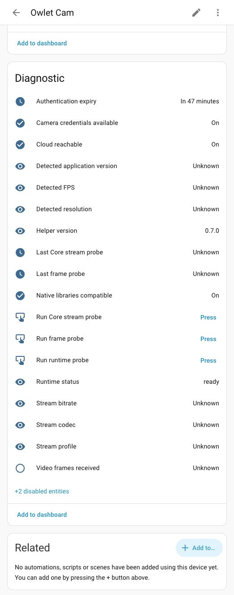

<p align="center">
  
</p>

# Owlet Cam for Home Assistant

[](https://github.com/ohlsont/ha-owlet-cam/actions/workflows/validate.yml)
[](https://github.com/ohlsont/ha-owlet-cam/actions/workflows/tests.yml)
[](https://www.hacs.xyz/)
[](LICENSE)

Bring an Owlet camera into Home Assistant as a native camera entity. View live
H.264 video, request snapshots, make recordings, monitor connection health, and
optionally expose room sensors from a compatible external bridge.

> [!CAUTION]
> This project is independent, unofficial, and currently pre-release. Embedded
> mode uses reverse-engineered behavior and user-supplied proprietary files.
> It has passed bounded real-camera testing on one Owlet Cam 1 and Home
> Assistant Yellow, but it is not yet a stable or generally supported release.

Owlet Cam is not affiliated with, endorsed by, or supported by Owlet or
ThroughTek.

## What works

| Capability | External bridge | Embedded experimental |
|---|---|---|
| Native Home Assistant camera | Yes | Yes |
| Live video | Bridge-provided RTSP | H.264 through a loopback-only MPEG-TS source |
| Incoming audio | Bridge-provided | Experimental AAC-LC; enabled by default |
| Still images | Bridge snapshot or stream | Yes |
| `camera.snapshot` | When the source supports it | Tested on Yellow |
| `camera.record` | When the source supports it | Tested on Yellow |
| Temperature, humidity, sound, light and Wi-Fi sensors | When exposed by the bridge | Not yet supported |
| Owlet cloud login | Not required | Required |
| User-supplied Owlet application files | Not required | Required once during setup |
| Architecture | Any Home Assistant architecture supported by the bridge client | AArch64 only |
| Validation status | Automated fake-bridge coverage; real bridge gate pending | Bounded real Owlet Cam 1 validation on Yellow |

Embedded incoming audio is experimental in 0.8.0 and enabled by default. Its
separate-pipe and AAC/MPEG-TS path has automated, synthetic, and
bounded real-camera Yellow FFprobe coverage. Owlet Cam 1 supplied AAC-LC in
native ADTS framing at 8 kHz mono without audio or video transcoding. Audible
Home Assistant live-view playback was confirmed on Yellow. Two-way talk is not
supported.

## Choose a connection mode

### External bridge

Use this mode when you already run a compatible
[`btoth525/Owlet-To-Rtsp`](https://github.com/btoth525/Owlet-To-Rtsp) bridge.
Home Assistant talks to the bridge's HTTP API and uses its RTSP stream. MQTT and
a separate Generic Camera configuration are not required.

This mode is architecture-independent and remains the fallback for unsupported
embedded installations. The adapter has comprehensive automated coverage, but
its real-bridge acceptance gate has not yet been performed by this project.

### Embedded experimental

Use this mode to run the camera protocol helper as an isolated child process
inside Home Assistant Core. Native Owlet/ThroughTek libraries are never loaded
into Home Assistant's Python process, and all internal media listeners bind to
`127.0.0.1`.

Embedded mode currently targets Home Assistant Yellow / AArch64. It requires a
compact private `.owletcam` package prepared from an Owlet application that you
legitimately obtained. The project does not distribute an APK, proprietary
library, SDK licence key, or camera credential.

## Requirements and support

- Home Assistant `2024.11.0` or newer.
- UI configuration through a config entry; YAML setup is not supported.
- HACS for the normal installation path.
- For embedded mode: Home Assistant OS on AArch64 is the only validated target.
- Tested camera: Owlet Cam 1, identified by the owner; firmware version was not
  available.
- Tested account region: Europe / EMEA. World / US has automated fixture
  coverage but no real-account gate.

Other camera models, architectures, and installation types must be considered
unsupported until they are recorded in [TEST_REPORT.md](TEST_REPORT.md).

## Installation with HACS

The repository is still private while release hardening is completed. These
steps apply after the first public release; a normal public HACS installation
has not yet been claimed as tested.

1. Install and configure [HACS](https://www.hacs.xyz/docs/use/).
2. Open HACS, select the three-dot menu, and choose **Custom repositories**.
3. Enter `https://github.com/ohlsont/ha-owlet-cam` and select
   **Integration**.
4. Select **Owlet Cam**, download a release, and restart Home Assistant.
5. Go to **Settings → Devices & services → Add integration** and search for
   **Owlet Cam**.

HACS preserves the integration's private `userfiles` directory across updates.
Never copy that directory into an issue or backup intended for sharing.

## Set up external bridge mode

Before setup, confirm that the bridge itself can receive video and that Home
Assistant can reach its HTTP(S) API.

1. Add the **Owlet Cam** integration.
2. Choose **External bridge**.
3. Enter the bridge base URL.
4. Optionally enter API credentials, an explicit RTSP source, or disable TLS
   verification for a trusted local endpoint.
5. If the bridge returns multiple cameras, select the camera to add.

Create another config entry for each additional bridge camera. The integration
rejects duplicate camera entries.

## Set up embedded experimental mode

### 1. Prepare a private `.owletcam` package

Download `owlet-cam-prepare.pyz` and its checksum from the same GitHub release
as the integration. Run it on a desktop computer; do not run APK acquisition
inside Home Assistant.

The recommended workflow uses an authorized Android device or a Play-enabled
Android Studio emulator with Dream already installed. Verify that Dream can
show live video before continuing, enable ADB, then run:

```bash
python3 owlet-cam-prepare.pyz adb owlet.owletcam
```

If more than one Android device is connected, add `--serial DEVICE`. The
default package is the current Dream app (`com.owletcare.sleep`); for the legacy
Owlet Care app, add `--package com.owletcare.owletcare`.

If you already have a legitimate APK, APKM, XAPK, or ZIP archive, minimize it
without downloading anything:

```bash
python3 owlet-cam-prepare.pyz archive dream.xapk owlet.owletcam
```

Advanced users may use [apkeep](https://github.com/efforg/apkeep) with a
private configuration file:

```bash
chmod 600 /path/to/apkeep.ini
python3 owlet-cam-prepare.pyz apkeep owlet.owletcam \
  --config /path/to/apkeep.ini
```

Only the configuration-file path is passed on the command line. Google
credentials or tokens must not be passed as arguments. apkeep warns that using
Google Play may carry account or Terms-of-Service risk, so use a separate
account if appropriate. APKPure and other third-party APK sources are not
supported by this project.

The generated `.owletcam` file contains exactly the required ARM64 libraries,
the SDK licence key extracted from your application, and integrity metadata. It
contains no Owlet account password, Firebase token, or camera credential. It is
still private proprietary material: do not publish or share it.

### 2. Add the integration

1. Add **Owlet Cam** and choose **Embedded experimental**.
2. Enter your Owlet email, password, region, camera serial, and camera name.
3. Select the prepared `.owletcam` package in Home Assistant's native file
   picker.
4. Finish setup. Native streaming is not started during the config flow.
5. Open the new Owlet Cam device, enable the disabled diagnostic entity
   **Run runtime probe**, and press it once.
6. Wait for **Runtime status** to become `ready` and
   **Native libraries compatible** to become on.

The camera serial normally begins with letters `OC`. The first character is the
letter `O`, not the digit `0`. Use the serial displayed in Dream; the
integration privately resolves any different internal camera identifier.

After the first successful explicit probe, future reloads and restarts rerun
the runtime safety gates automatically. The uploaded `.owletcam` package is
deleted after extraction by default, while the extracted libraries and SDK key
remain private so the camera can recover after a restart.

## Home Assistant entities

Each camera is represented as one Home Assistant device.

### Camera and health

- Native camera entity with snapshots and, when available, stream support.
- Cloud reachability and camera-credential availability.
- Camera, stream, and bridge health in external mode.
- Authentication expiry.

### External bridge sensors

When supported by the bridge, the device exposes temperature, humidity, sound
level, illuminance, Wi-Fi signal, stream FPS, and reconnect count. Temperature
is requested in metric units and Home Assistant handles display conversion.

### Embedded diagnostics

Runtime status, helper version, application version, ABI, library
compatibility, detected resolution/FPS, stream codec/profile/bitrate, frame
receipt, audio status/codec, safe audio failure code, and last bounded probe
results are available without exposing secret values. Diagnostic action buttons
are disabled by default.

## Screenshot

The embedded device page exposes runtime health and bounded diagnostic actions
without displaying account or camera credentials:

<p align="center">
  
</p>

Camera imagery is deliberately excluded from repository screenshots to protect
the test household's privacy.

## Options and stream behavior

Open **Settings → Devices & services → Owlet Cam → Configure** to change
behavior. Options are grouped into general, external-bridge, and embedded
sections.

Defaults favor stability and coexistence with the official app:

- Keep camera session warm: off.
- Idle disconnect: 60 seconds.
- Incoming audio: on; disable it for video-only operation when necessary.
- Prefer direct P2P: observation only; not enforced.
- Experimental local sensors: off.
- Retain uploaded application package: off.

Embedded media starts when Home Assistant requests it and stops after the idle
timeout unless keep-warm is enabled. Multiple Home Assistant viewers share one
native camera producer. H.264 and supported AAC are copied without
transcoding. Audio uses a separate inherited helper pipe; an audio failure is
recorded and drained independently so the H.264 stream can continue.

## Reconfigure, reauthenticate, and remove private files

- Use **Reconfigure** to update camera/account details or replace the private
  `.owletcam` package.
- If authentication expires, Home Assistant starts the normal reauthentication
  flow and updates the existing entry rather than creating a duplicate.
- Reconfigure also provides a separate confirmation-gated action to delete all
  uploaded applications, extracted proprietary libraries, and SDK material.
  The verified open-source helper remains installed, but embedded video stops
  until a new package is supplied and validated.
- Removing the config entry unloads its entities and terminates supervised
  helper processes.

## Privacy and security

- The project never distributes Owlet APKs, ThroughTek libraries, SDK keys, or
  user camera credentials.
- Account credentials live in Home Assistant config-entry data, not in
  `userfiles`.
- Firebase and camera-session credentials are kept in memory and passed to the
  helper through stdin, never command-line arguments.
- Native protocol code runs in a separately supervised process and is never
  imported into Home Assistant's Python process.
- Internal media/control endpoints bind to loopback only.
- Helper release assets are exact-version pinned, SHA-256 verified, inspected
  for prohibited files, and installed atomically.
- Diagnostics, repairs, logs, and frontend errors use fixed redacted fields and
  safe error codes.
- No certificate interception, privileged mode, Docker access, host PID/IPC,
  AppArmor change, or separate Home Assistant add-on is required.

Read [SECURITY.md](SECURITY.md) for storage locations, deletion instructions,
binary verification, and vulnerability reporting.

## Repairs and troubleshooting

Home Assistant Repairs provide actionable guidance for missing packages,
missing ARM64 splits or libraries, wrong architecture, absent SDK key, checksum
failure, incompatible native runtime, reauthentication, obsolete helper
versions, and repeated stream recovery failure.

| Symptom | What to check |
|---|---|
| Owlet Cam does not appear in Add integration | Restart Home Assistant after the HACS download and confirm the repository type is **Integration**. |
| HACS cannot add the repository | The normal HACS path requires the public repository. This repository is private during pre-release development. |
| Camera serial is rejected | Use the app-visible value beginning with letters `OC`; do not type digit `0` as the first character. |
| Authentication fails | Verify the same email, typed password, and region in Dream. Apple/Google sign-in alone may not provide a usable Owlet password. |
| Runtime package is rejected | Regenerate it with the matching release's preparer. Do not rename an APK to `.owletcam`. |
| Missing ARM64 libraries | Use a Play installation containing the `arm64-v8a` split and prepare the package again. |
| Runtime download fails | Confirm internet access and that a matching public GitHub release contains the AArch64 helper and checksums. |
| Runtime never becomes ready | Open the associated Repair, enable **Run runtime probe**, and download redacted diagnostics after the bounded probe. |
| Camera is temporarily unavailable | Wait for bounded recovery. If it persists, close the official app, leave keep-warm off, then use **Restart embedded stream**. |
| Live view has no audio | Confirm **Incoming audio** remains enabled in integration options, reopen the stream, and inspect **Audio status** / **Audio codec**. `unavailable` means the camera returned an unsupported codec or the isolated audio path failed; video should continue. |

For support, download diagnostics from the Owlet Cam device and open an issue.
Never attach an APK, `.owletcam` file, SDK key, account password, token, camera
UID, AuthKey, or AV password.

## Known limitations

- The repository is private and has not completed a normal public HACS
  installation or anonymous helper-release download.
- Embedded mode is validated only on AArch64 Home Assistant Yellow with one
  user-reported Owlet Cam 1.
- External bridge mode has automated compatibility tests but no completed real
  bridge/media acceptance gate.
- Embedded incoming audio is experimental. Real Owlet Cam 1 media passed the
  Core-local Yellow decode probe and audible Home Assistant live-view playback.
  Two-way talk, lullabies, and embedded room sensors are unsupported.
- Cloud authentication and fresh camera connection metadata remain necessary;
  the project does not claim fully offline operation.
- Formal two-hour/overnight viewing, Companion app inside/outside LAN, physical
  camera/Wi-Fi/internet interruption, and broad multi-user tests were waived or
  remain unperformed. Bounded video, reload, restart, two-viewer, snapshot, and
  recording tests are recorded separately.
- The local brand art has not yet been submitted to Home Assistant Brands.

The complete, deliberately conservative evidence ledger is in
[TEST_REPORT.md](TEST_REPORT.md). Unsupported or waived tests are not claimed
as passed.

## Development

This is a clean-room implementation informed by public protocol observations.
Exact inspected reference commits, licences, whether source was copied, and
clean-room notes are recorded in [REFERENCE_VERSIONS.md](REFERENCE_VERSIONS.md).

Useful project documents:

- [CHANGELOG.md](CHANGELOG.md) — user-visible changes and release status.
- [TEST_REPORT.md](TEST_REPORT.md) — automated and real-system evidence.
- [SECURITY.md](SECURITY.md) — threat model, storage, deletion, and reporting.
- [helper/README.md](helper/README.md) — open-source helper build design.

Run the local quality suite with [uv](https://docs.astral.sh/uv/):

```bash
uv sync --all-groups
uv run pytest
uv run ruff format --check .
uv run ruff check .
uv run mypy custom_components scripts
uv run python scripts/check_secrets.py
uv run python scripts/validate_release.py
```

Contributions are welcome, especially evidence for additional camera models,
architectures, regions, and external bridge versions. Do not submit
proprietary files or captured secrets.

## Licence

This project's original clean-room source, documentation, tests, workflows, and
artwork are available under the [MIT licence](LICENSE), copyright 2026 Tomas
Ohlson and ha-owlet-cam contributors.

That licence does not cover user-supplied Owlet applications, Owlet/ThroughTek
libraries, SDK keys, camera credentials, or other proprietary material.
Separately distributed AOSP runtime components retain their own licences and
ship with their applicable notices. See
[THIRD_PARTY_NOTICES.md](THIRD_PARTY_NOTICES.md) for the complete boundary.
